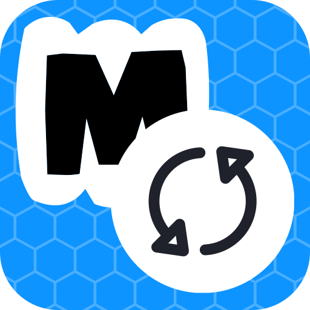

# ModSync

ModSync is a SteamOS/Linux modding hub for Skyrim SE, including multi-device sync.
Features include:

- Game version downgrading
  - Thanks to [Mulderland's Skyrim SE downgrader](https://github.com/Mulderland/MulderLoad)
- SKSE installation based on game version 
- [Mod Organizer 2](https://github.com/ModOrganizer2/modorganizer) installer
  - Thanks to [MO2-LINT](https://github.com/Furglitch/modorganizer2-linux-installer)
- Multi-device sync for your Steam Deck, Steam Machine, Steam Frame, or other Linux hardware 

## Install

Download the `.flatpak` from the [releases tab](https://github.com/skjiisa/ModSync/releases).

SteamOS:

- Double click to open the `.flatpak` file in Discover and install it from there

Other:

```bash
flatpak install --user ~/Downloads/ModSync-*-x86_64.flatpak
flatpak run io.github.skjiisa.ModSync
```

To build from source, see [advanced.md](docs/advanced.md).

## First run

It's recommended to close Steam for the first run

Run through the setup wizard. Optionally, there are buttons to:
- Add ModSync as a Steam Shortcut
- Make Steam launch ModSync instead of Skyrim when opening Skyrim

## Game version

The "Skyrim Special Edition version" section allows for pinning a game version and gives you the option to downgrade to it whenever Steam updates Skyrim. No more worrying about stopping updates before they happen!

## Syncing between machines (optional)

ModSync allows syncing mod lists between multiple systems.

- Install ModSync on each system, set up Mod Organizer 2 on each, then choose one to be the host and pair the others using the "Sync with another machine" section.
- For easy pairing, have the host click "Pair over network", then on the other machine, press "Scan network" to have them find each other
  - Enter the pairing code to confirm the connection
  - You may need to allow ModSync through the firewall. If you see a warning, simply click "Allow in firewall..." to proceed.

Mod list syncing uses [Syncthing](https://github.com/syncthing/syncthing) under the hood 

### Background service (optional)

"Run in background" allows ModSync to run while closed so you don't have to worry about running it to keep your mods in sync between systems.

## Play button (optional)

You can Launch Skyrim or Mod Organizer 2 through Proton with ModSync directly.
If you want to have ModSync open when launching the game through Steam, click "Open ModSync before Skyrim", that way your mods can always stay in sync if you change them frequently.
 - If using this setting, restart steam after enabling it

## Command line

See [advanced.md](docs/advanced.md) for command-line usage.

## Third-party components and licenses

ModSync is free software under the GNU GPL, version 3 or later. See [LICENSE](LICENSE).
It builds on, bundles or downloads the components below. ModSync does not distribute
any Bethesda game files. The downgrade patches are binary deltas that only apply to a
copy of Skyrim Special Edition you already own through Steam.

| Component | Role | How you get it | License |
| --- | --- | --- | --- |
| [Syncthing](https://github.com/syncthing/syncthing) | sync engine, driven over its REST API | bundled in the Flatpak; otherwise downloaded from its GitHub releases on first use | MPL-2.0 |
| [7-Zip](https://7-zip.org/) (`7zz`) | unpacks the downgrade patch archives | bundled in the Flatpak, built from source; otherwise your system `7z`, `7zz` or `bsdtar` | LGPL-2.1-or-later with the unRAR restriction and BSD-licensed parts, see its [License.txt](https://github.com/ip7z/7zip/blob/main/DOC/License.txt) |
| [SKSE](https://skse.silverlock.org/) | the Skyrim Script Extender | downloaded from skse.silverlock.org on request and verified against a pinned SHA-256; not bundled | its own [license](https://skse.silverlock.org/): free to redistribute unmodified, no source |
| [xdelta3](https://github.com/jmacd/xdelta-gpl) | applies the binary patches | bundled in the Flatpak (3.1.0 from the `xdelta-gpl` repository); otherwise your system `xdelta3` | GPL-2.0-or-later |
| [PySide6](https://pypi.org/project/PySide6-Essentials/) / Qt 6 | the GUI | bundled in the Flatpak on the KDE runtime; a dependency of the source install | LGPL-3.0-only OR GPL-2.0-only OR GPL-3.0-only |
| [MO2-LINT](https://github.com/Furglitch/modorganizer2-linux-installer) | installs Mod Organizer 2 into the game's Proton prefix | downloaded on demand as a pinned prebuilt binary when you choose Install MO2 | GPL-3.0 |
| [Mod Organizer 2](https://github.com/ModOrganizer2/modorganizer) | the mod manager | installed by MO2-LINT; not bundled or downloaded by ModSync itself | GPL-3.0 |
| [Mulderland's Skyrim SE downgrader](https://github.com/Mulderland/MulderLoad) | the downgrade recipe and the community xdelta patches it points to | ModSync converts the recipe to JSON and downloads the patches from Mulderland's CDN only when you ask for a downgrade | no license declared upstream |
| [httpx](https://github.com/encode/httpx) | HTTP client for the Syncthing API | Python dependency | BSD-3-Clause |
| [platformdirs](https://github.com/tox-dev/platformdirs) | data and config directories | Python dependency | MIT |
| [qrcode](https://github.com/lincolnloop/python-qrcode) | pairing QR codes | Python dependency | BSD-3-Clause |
| [spake2](https://github.com/warner/python-spake2) | PIN-authenticated LAN pairing, with `cryptography` | Python dependency | MIT |

The Flatpak runs on the `org.kde.Platform` runtime, whose contents carry their own
licenses. Steam, Proton and `protontricks` are used where installed and are not part
of ModSync.
