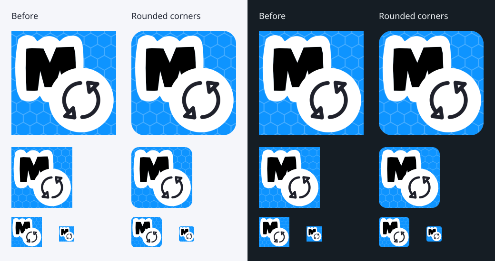

# Icon presentation review

The same source artwork, with transparent rounded corners. The letter, arrows,
colors, hexagon pattern and their positions are unchanged. A 64px corner radius
at 512px softens the tile while retaining its size and alignment.

The SVG wraps the original artwork in a rounded clipping path; the PNG is
rendered from that SVG using the existing librsvg workflow. No new artwork,
color treatment, border or shadow is added.

The comparison shows the original on the left and rounded version on the right
for each background, at 220, 128, 64 and 32 pixels.

Validation: SVG artwork is byte-for-byte identical after removing the outer
clip and wrapper. PNG transparency is confined to the corners; all pixels outside the
corner regions retain their original colors. Both packaged formats are updated.
