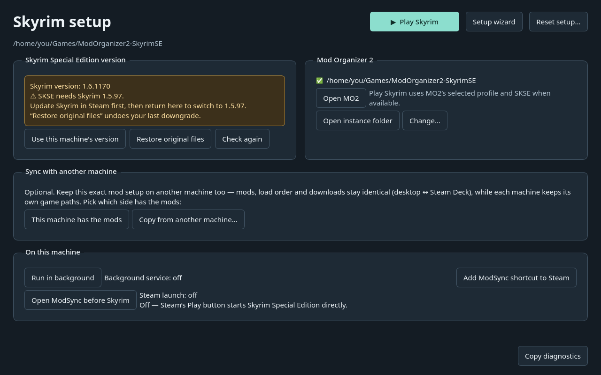
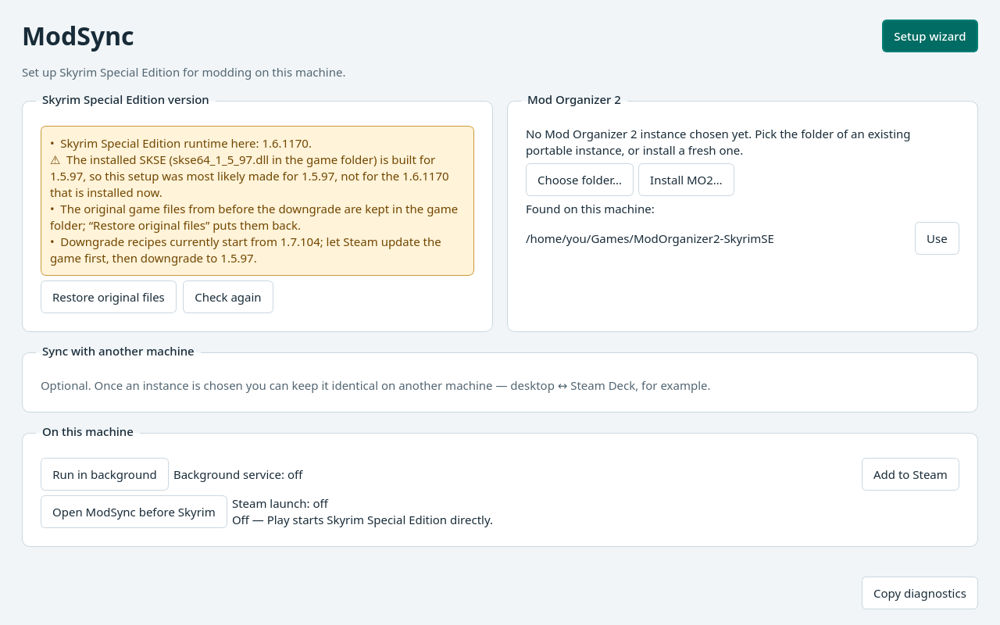
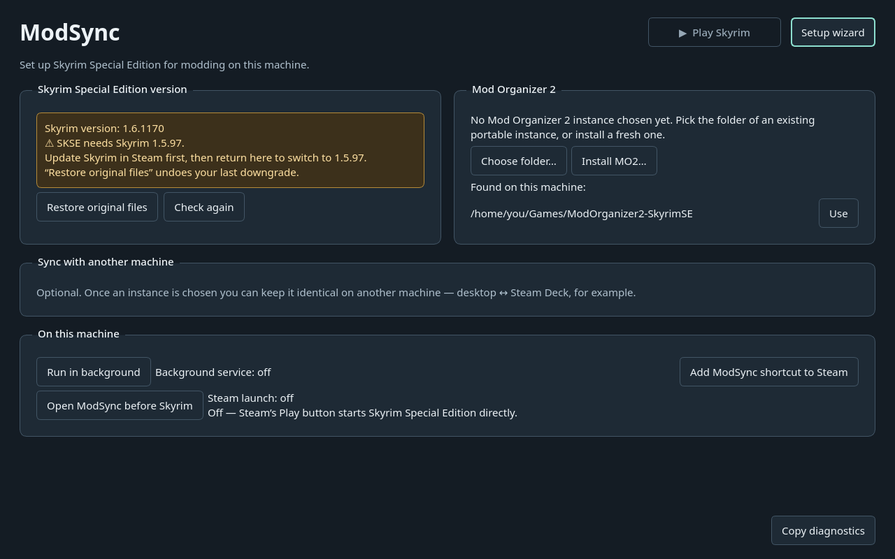
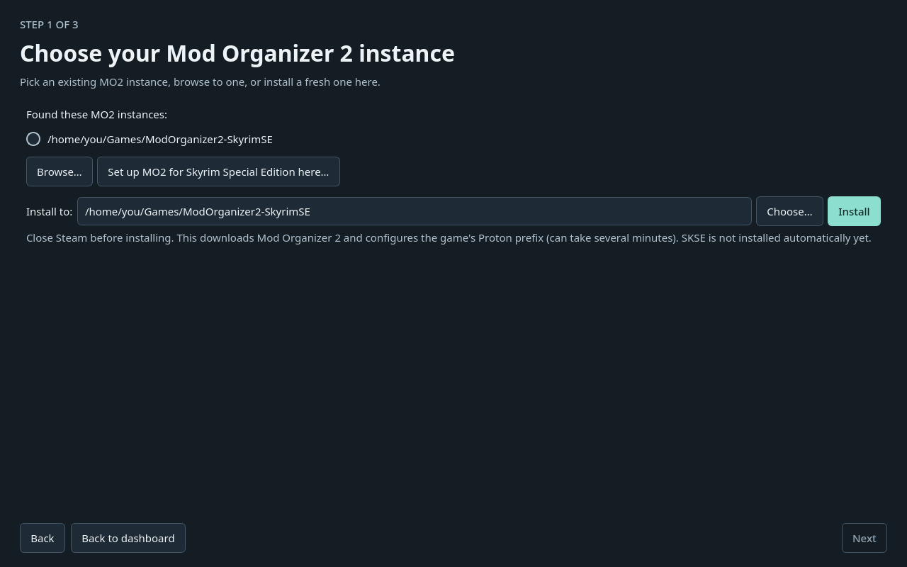
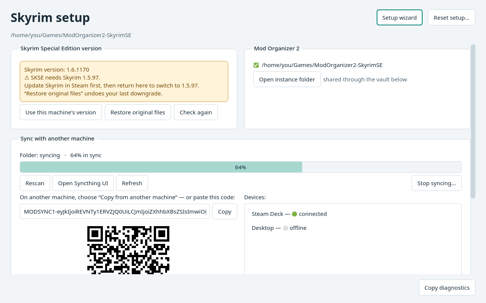
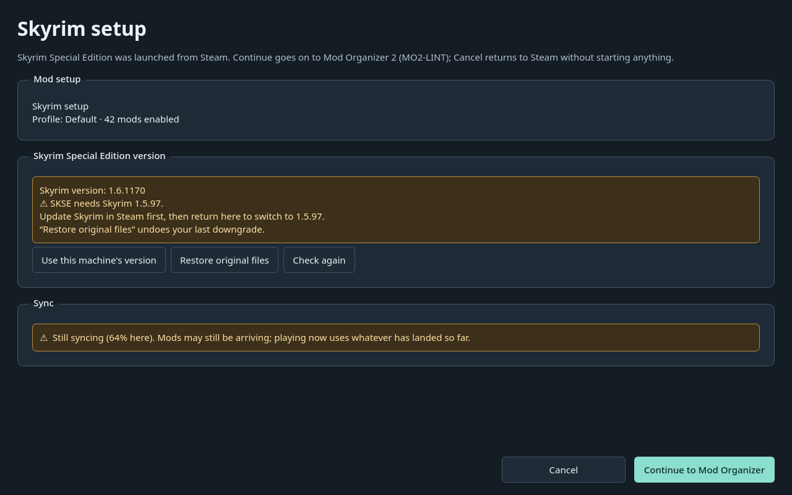

# UI review: readability and layout

This is a proposed UI pass, kept unmerged for visual review. The previews use
synthetic game/setup data; no installation, game modification or syncing occurs
when generating them.

## What changed

- Shorten Skyrim version warnings to the problem and next step,
  and move DLL/patch details into a tooltip.

- Replace every text use of Qt's `Mid` border/shading color with a shared,
  readable secondary text color. Light and dark themes follow the system setting.
- Increase the base text size (while retaining larger user font settings), give
  controls more space, make keyboard focus visible, and distinguish warnings.
- Wrap game actions and stack the top dashboard cards below 1000 pixels wide.
  Wizard content scrolls while navigation stays visible.
- Move sync progress above pairing details and keep pairing codes scrolled to
  their beginning.
- Rename the Steam action to “Add ModSync shortcut to Steam” and clarify that
  it creates a non-Steam shortcut.
- Make “Install MO2…” open the installation step. Add step labels, a shorter
  welcome screen and a way back to the dashboard from each idle setup step.

## Launching MO2 and Skyrim

“Open MO2” opens the chosen portable instance. The prominent “Play Skyrim”
button uses that instance’s selected profile and prefers SKSE. Start Steam
before playing. Both actions use the Proton Steam has chosen for Skyrim (seen through
ModSync’s launch hook), falling back to the one that last set up its prefix,
plus the runtime that Proton requires. Launch errors point to a log file.



## Dashboard





## Installation



## Sync

The status and progress appear before the pairing code, QR and devices. The
remaining pairing controls are reachable by scrolling.



## Steam launch hub



## Try the branch

From the source checkout on `ui/readability-and-layout`:

```sh
.venv/bin/python -m modsync
```

This opens the actual app with your local setup. The installed Flatpak is a
separate build and does not pick up source edits automatically.

To regenerate all 16 offline previews (including welcome, optional sync and a
900-pixel-wide dashboard) without reading or modifying your setup:

```sh
.venv/bin/python scripts/preview_ui.py --output scratch/ui-review
```

Previews and layout checks were run with Qt's offscreen platform on desktop
Linux. This is not a Steam Deck hardware or controller test.
