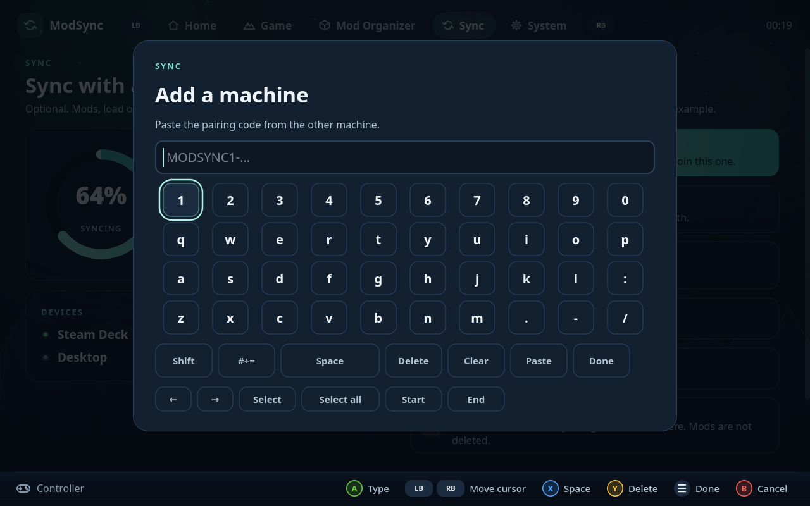

# UI previews

The screenshots in this folder come from `scripts/preview_ui.py`, which
renders the window with synthetic game, setup and sync data. Generating them
does not read your setup, install anything, modify the game or sync. They are
1280 × 800, the Steam Deck's screen.

## Home

The readiness checklist sits next to Play. Each check opens the section that
can fix it. The glowing frame marks focus, and the hint bar along the bottom
shows the buttons of the controller in use.


## Opened from Steam's Play button

With the launch hook on, Steam's Play button opens this same window. Play
becomes Continue, which hands Steam's launch on to MO2-LINT or the game.
Cancel launch, one move down, returns to Steam. A warning appears while the
vault is still syncing. Here a keyboard is in use, so the hints show keys.


## Game


## Sync

The live view with a PlayStation controller connected. The hint bar shows
PlayStation symbols. Y (triangle) rescans.


Pairing with a machine found on the network. Up and down turn each digit of
the PIN, and left and right move between digits. Typed digits work too.


Text entry opens an on-screen keyboard with a Paste key.



## System


## Setup wizard


## Regenerate the previews

From a source checkout:

```sh
uv run python scripts/preview_ui.py --output scratch/ui-review
```

This writes all 19 offline previews, including the confirmation sheet, the
folder browser, the install sheet, the network PIN and a 1000 pixel wide
window used with a mouse, using Qt's offscreen platform. Copy the ones you
want into this folder and compress them with `optipng`. The installed Flatpak
is a separate build and does not pick up source edits.
