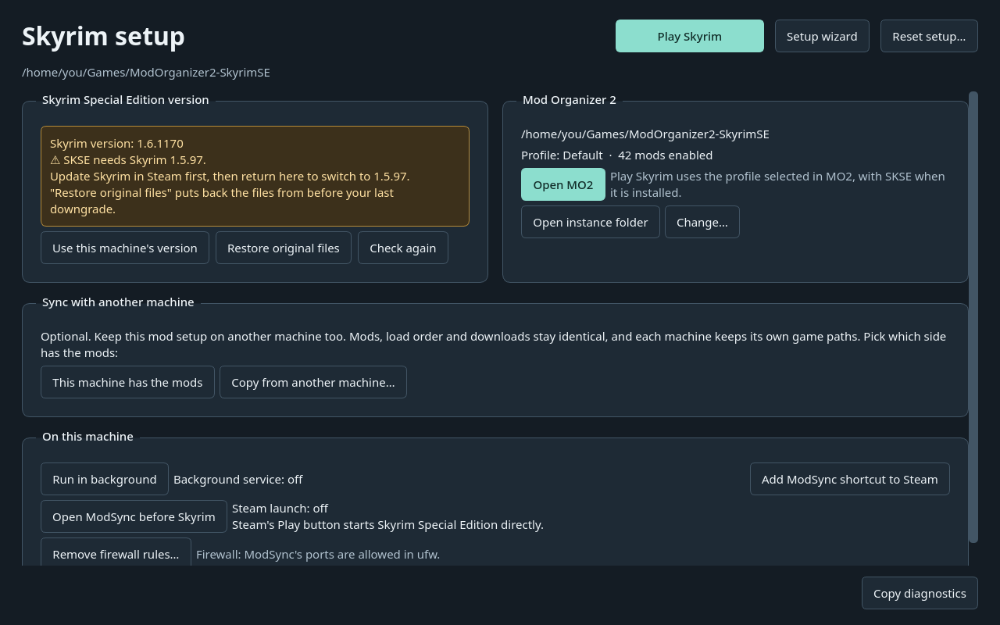
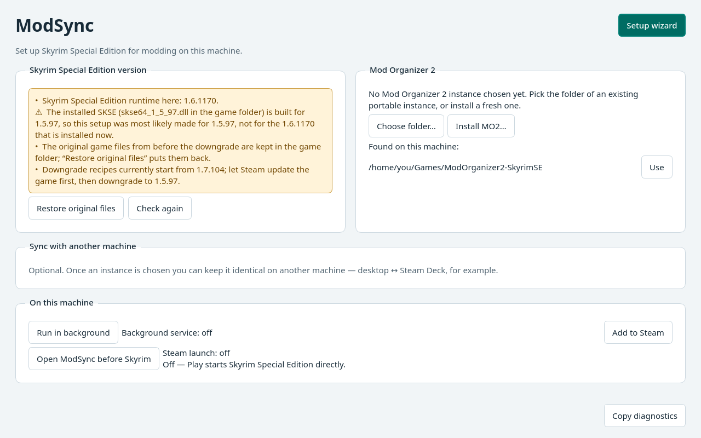
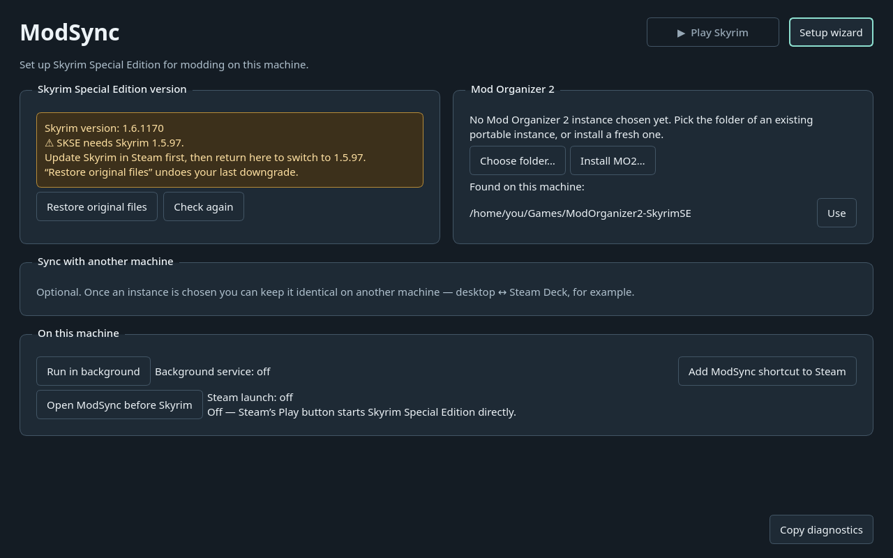
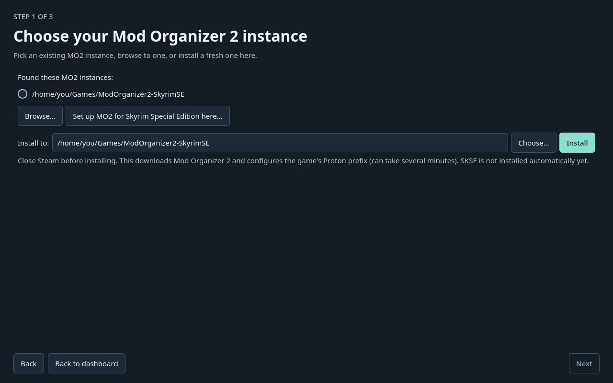
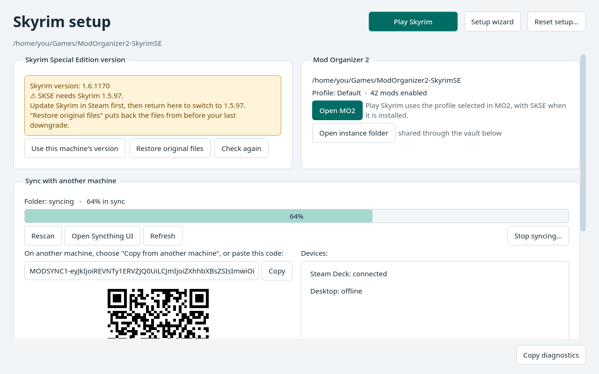
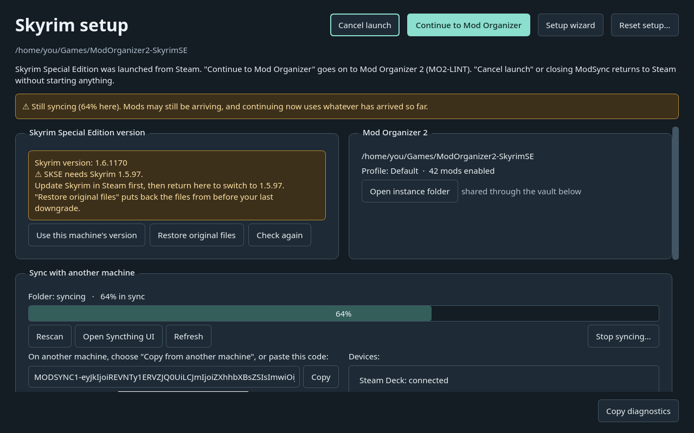

# UI previews

The screenshots in this folder come from `scripts/preview_ui.py`, which
renders the dashboard (also as Steam's launch hook opens it) and the setup
wizard with synthetic game and setup data. Generating them does not read your setup, install anything, modify
the game or sync.

## Launching MO2 and Skyrim

"Open MO2" opens the chosen portable instance. The "Play Skyrim" button uses
that instance's selected profile and prefers SKSE. Steam must be running first.
Both actions use the Proton that Steam has chosen for Skyrim (as seen through
ModSync's launch hook), or the one that last set up its prefix, plus the
runtime that Proton needs. Launch errors point to a log file.



## Dashboard





## Installation



## Sync

Status and progress appear above the pairing code, QR and device list. The
remaining pairing controls are reachable by scrolling.



## Opened from Steam's Play button

With the launch hook on, Steam's Play button opens this same dashboard. Play
becomes Continue, which hands Steam's launch on to MO2-LINT or the game, and
Cancel launch returns to Steam. Open MO2 is not shown, because Steam is
already about to start the game. A warning appears when the vault is still
syncing.



## Regenerate the previews

From a source checkout:

```sh
uv run python scripts/preview_ui.py --output scratch/ui-review
```

This writes all 16 offline previews, including the welcome screen, the optional
sync step and a 900 pixel wide dashboard, using Qt's offscreen platform. Copy
the ones you want into this folder. The installed Flatpak is a separate build
and does not pick up source edits.
