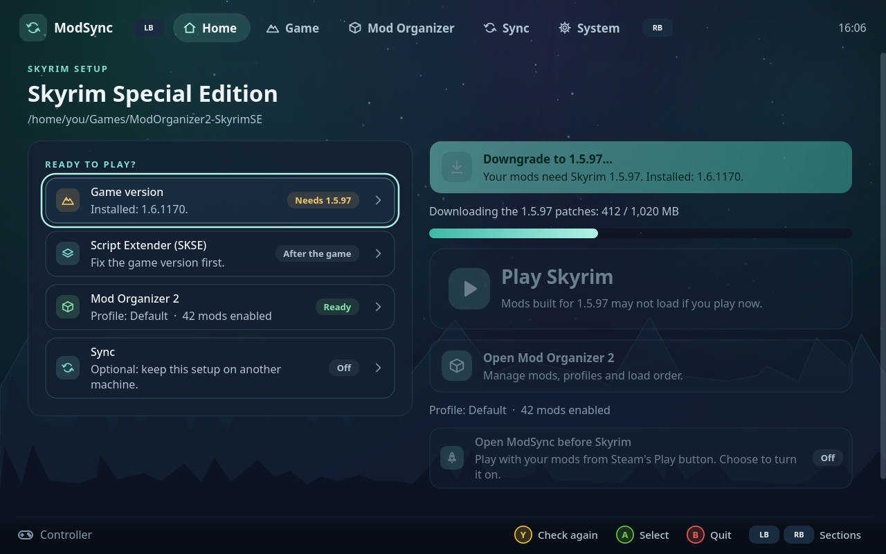

# UI previews

The screenshots in this folder come from `scripts/preview_ui.py`, which
renders the window with synthetic game, setup and sync data. Generating them
does not read your setup, install anything, modify the game or sync. They are
1280 × 800, the Steam Deck's screen.

## Home

Home holds what most people need: Play, Open Mod Organizer 2, the repair
that is due and "Open ModSync before Skyrim". When the game version or SKSE
does not match, Steam has an update waiting, or MO2 needs its runtime or the
ARM64 fix, the tile above Play runs that repair. It gets the accent fill;
Play stays available with the consequence explained. Each readiness check
opens the section with its details. A single outline marks focus.


A downgrade or SKSE install shows its progress under the repair tile.
Everything else on Home waits until it finishes.



When the game is ready, Play becomes the primary action again.


## Opened from Steam's Play button

With the launch hook on, Steam's Play button opens this same window. Play
becomes Continue, which hands Steam's launch on to MO2-LINT or the game.
Cancel launch, one move down, returns to Steam. A warning appears while the
vault is still syncing. Here a keyboard is in use, so the hints show keys.


## Game


## Sync

The live view with a PlayStation controller connected. The hint bar shows
PlayStation symbols. Y (triangle) rescans.


Pairing with a machine found on the network, here with a mouse. With a
controller, up and down turn each digit and left and right move between
digits; with a mouse or touch screen, the digit row fills them in. Typed
digits work too. With a mouse or touch screen the hint bar turns into
buttons for what can't be tapped elsewhere, such as Cancel.


Text entry opens an on-screen keyboard with a Paste key. Shift produces
punctuation, and "#+=" opens the full symbols layer. LB / RB or the arrow
buttons move the cursor. Select and Select all let a controller replace part
or all of an entry. The cursor and selection stay visible while a key has
focus.


## System

Settings most people set once, and the rare actions. Settings details and
Controls open in sheets with the background-service explanation, firewall
ports and input shortcuts.


## Setup wizard


The game step emphasizes the action that fixes the unresolved problem.
Finish anyway explains what will remain unresolved. When the version is
ready, Finish is the primary action and optional installs are secondary.


## Regenerate the previews

From a source checkout:

```sh
uv run python scripts/preview_ui.py --output scratch/ui-review
```

This writes all 30 offline previews, including the confirmation sheet, the
folder browser, the install sheet, the network PIN and a 1000 pixel wide
window used with a mouse, keyboard symbols and selection, and validation at
1000 pixels wide, using Qt's offscreen platform. This folder keeps
one screenshot per screen to stay small. Copy the ones you want here and
compress them with `optipng`. The installed Flatpak
is a separate build and does not pick up source edits.
