# UI previews

The screenshots in this folder come from `scripts/preview_ui.py`, which
renders the window with synthetic game, setup and sync data. Generating them
does not read your setup, install anything, modify the game or sync. They are
1280 × 800, the Steam Deck's screen.

## Home

Home, Sync and Settings are the three tabs. Home offers installation,
selection, repairs and launching without requiring a tab change. The MO2,
game version and SKSE rows open maintenance sheets for the remaining controls.
All standard Home actions fit at 1280 × 800 without scrolling or smaller fonts.

On first run, install MO2 directly, use an existing installation, or follow
guided setup. Copying an existing setup from another machine has an early
entry point too.

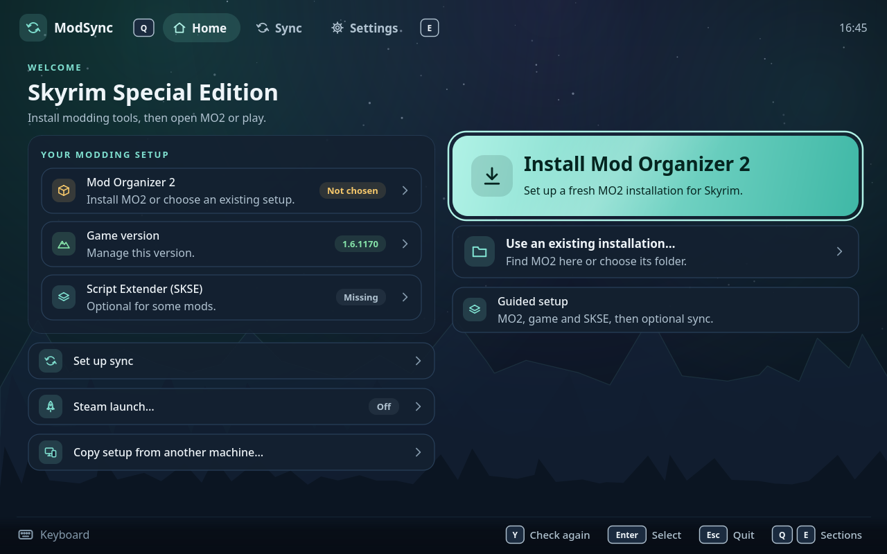

A repair runs from Home and shows its progress there. Play remains available
with any launch consequence explained. A single outline marks focus.

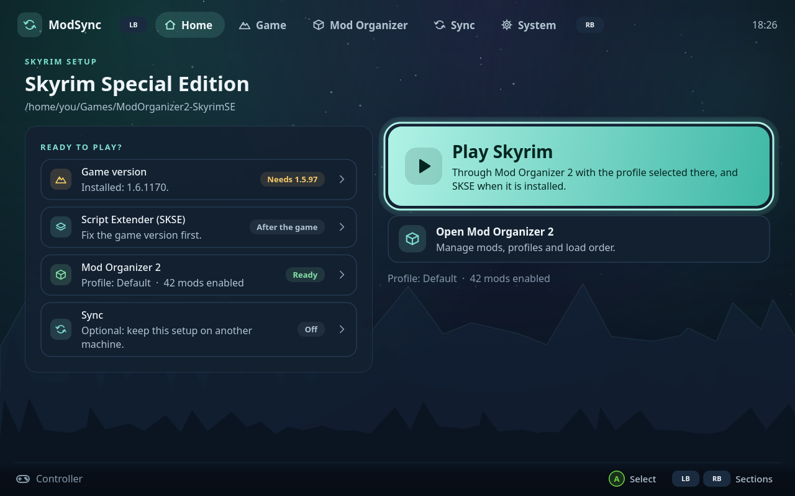

When the setup is ready, Play becomes the primary action.

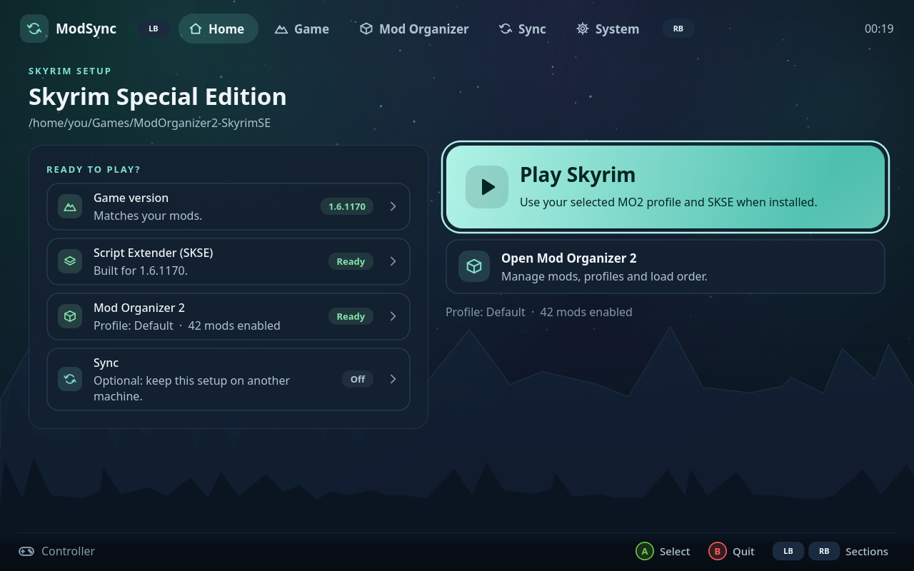

Missing SKSE is recommended as a setup step; users can still play without it.

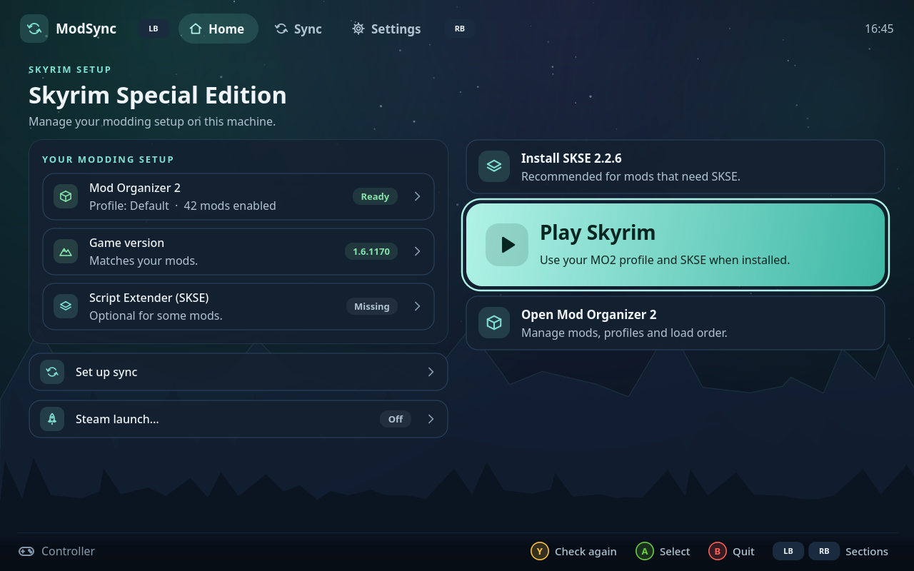

Steam setup opens a sheet with the launch hook and Steam shortcut controls.
The same settings remain available in Settings.

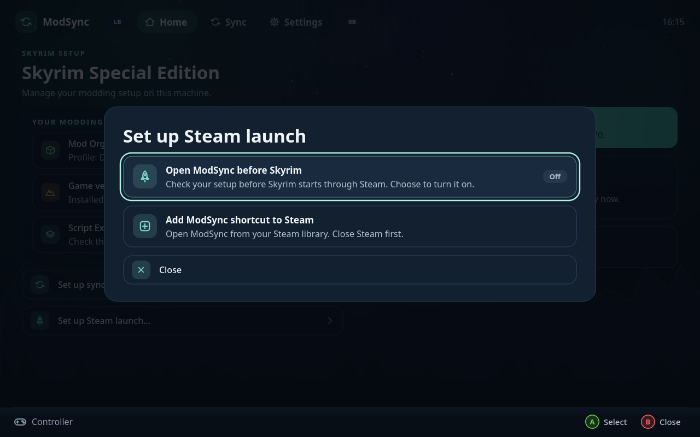

## Opened from Steam's Play button

With the launch hook on, Steam's Play button opens this same window. Play
uses the selected MO2 setup. Before MO2 is chosen, Continue hands the launch
on to MO2-LINT or the game. Cancel launch returns to Steam. A warning appears
while the vault is still syncing. Here a keyboard is in use, so the hints show keys.

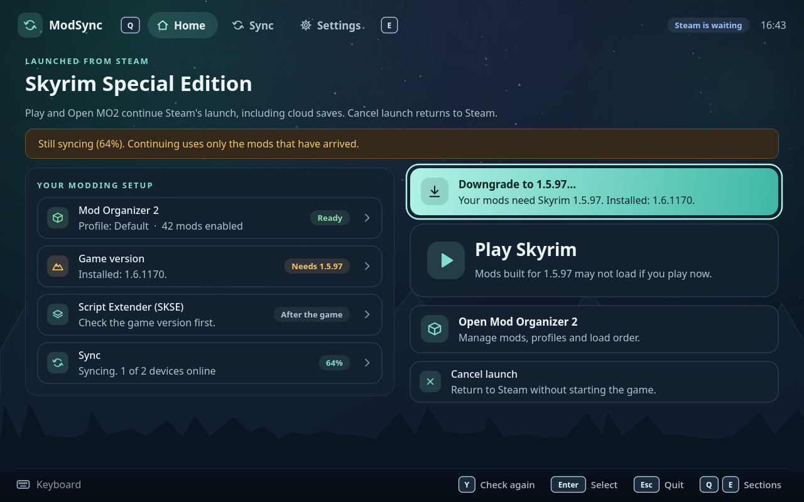

## Game maintenance

The Game version row opens this sheet. Restore, unpin and technical details
remain available here. Its content scrolls; Close stays visible.

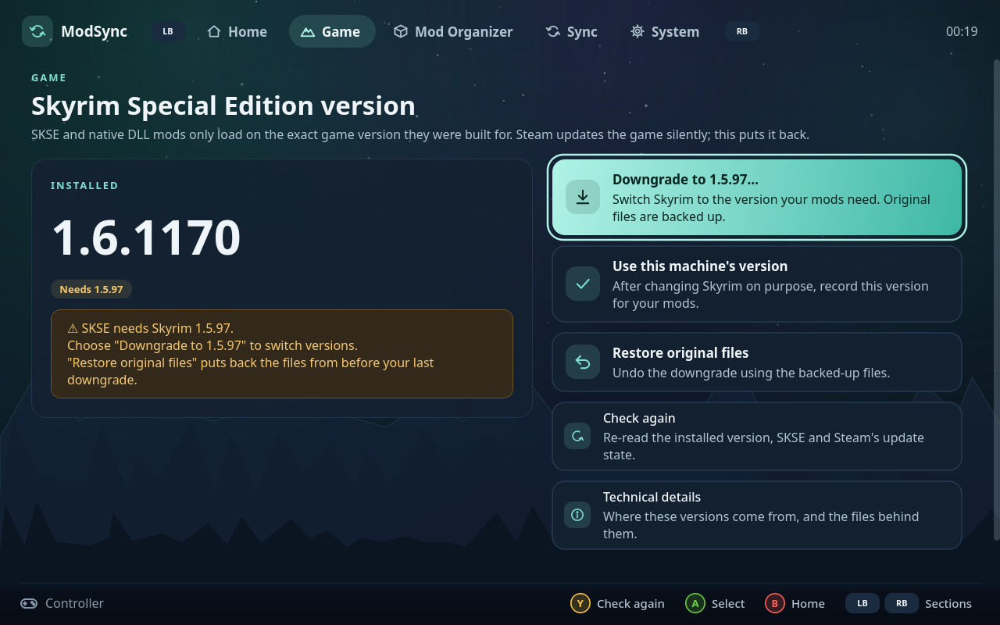

## Sync

The live view with a PlayStation controller connected. The hint bar shows
PlayStation symbols. Y (triangle) rescans.

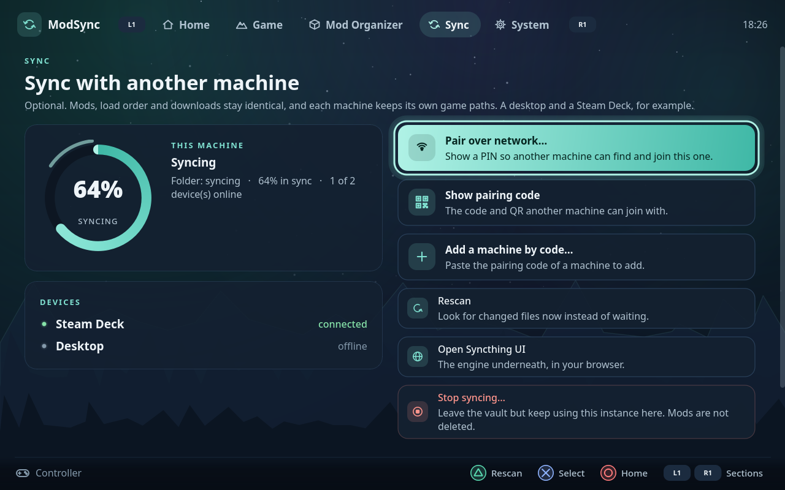

Pairing with a machine found on the network, here with a mouse. With a
controller, up and down turn each digit and left and right move between
digits; with a mouse or touch screen, the digit row fills them in. Typed
digits work too. With a mouse or touch screen the hint bar turns into
buttons for what can't be tapped elsewhere, such as Cancel.

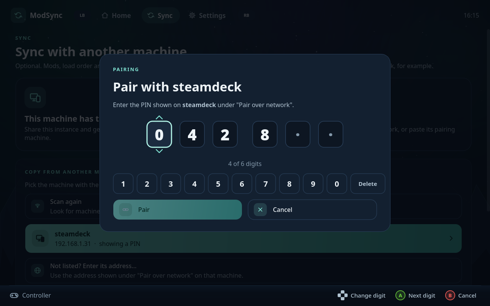

Text entry opens an on-screen keyboard with a Paste key. Shift produces
punctuation, and "#+=" opens the full symbols layer. LB / RB or the arrow
buttons move the cursor. Select and Select all let a controller replace part
or all of an entry. The cursor and selection stay visible while a key has
focus.

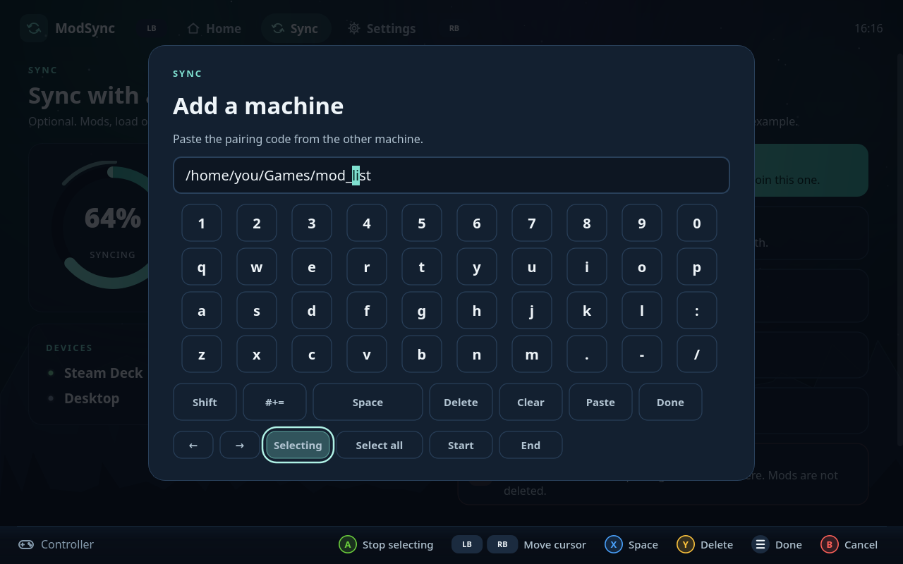

## Settings

Short descriptions keep the actions visible together. Settings details and
Controls open in sheets with the background-service explanation, Steam
launch status, firewall ports and input shortcuts.

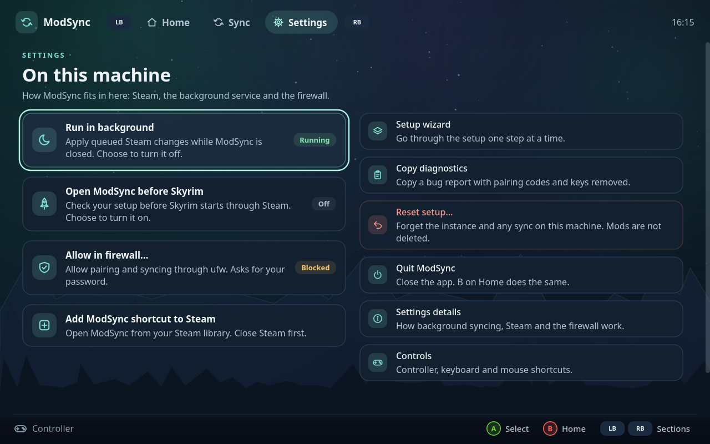

## Setup wizard

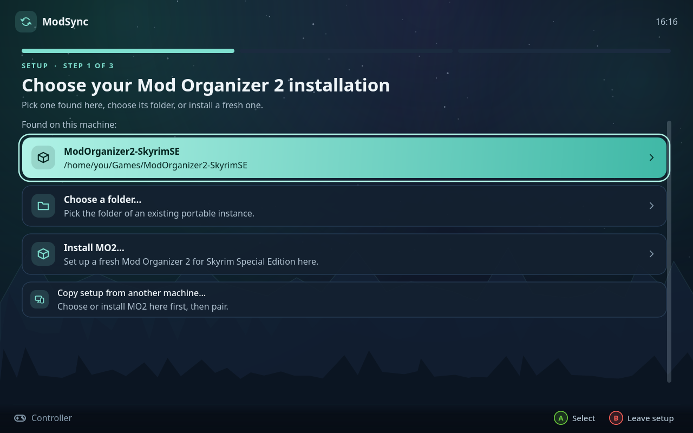

The second step prepares the game version and matching SKSE. Continue anyway
explains an unresolved problem; Continue without SKSE explains which mods
need it. The final step makes sync optional, with Finish without sync first.
The early copy route skips game preparation until the incoming mods arrive.

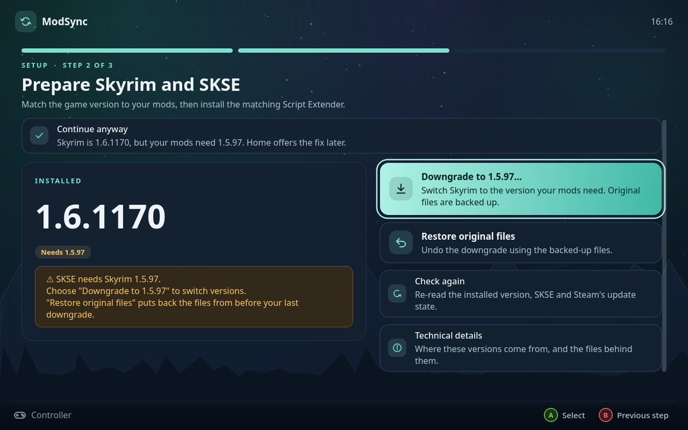

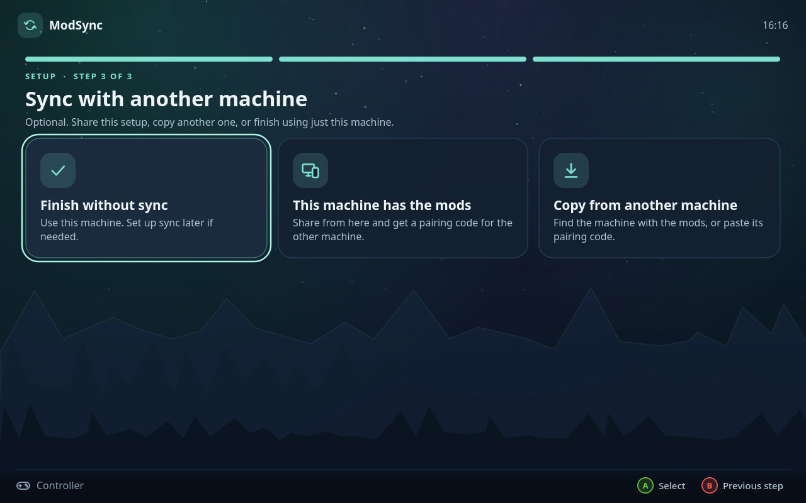

## Regenerate the previews

From a source checkout:

```sh
uv run python scripts/preview_ui.py --output scratch/ui-review
```

This writes offline previews, including the confirmation sheet, the
folder browser, the install sheet, the network PIN and a 1000 pixel wide
window used with a mouse, keyboard symbols and selection, and validation at
1000 pixels wide, using Qt's offscreen platform. This folder keeps
selected setup, ready, repair and maintenance screenshots. Copy the ones you
want here and compress them with `optipng`. The installed Flatpak
is a separate build and does not pick up source edits.
